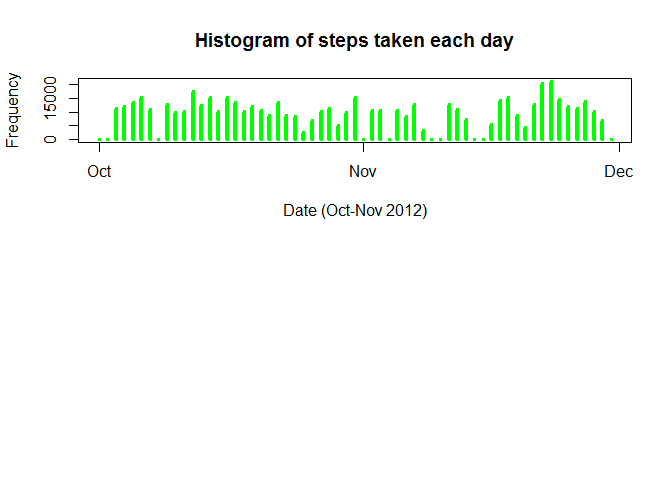
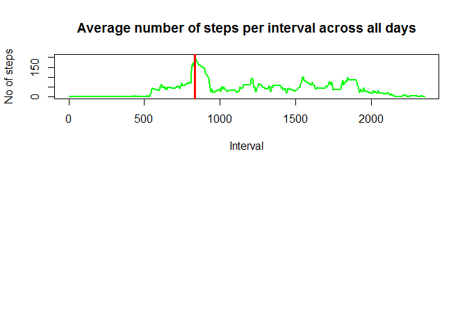
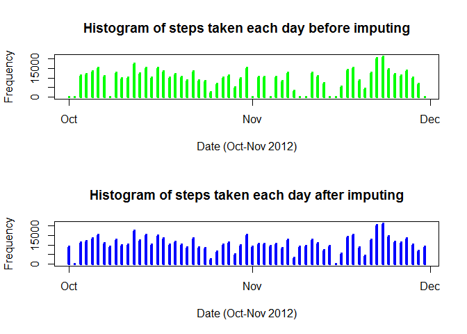
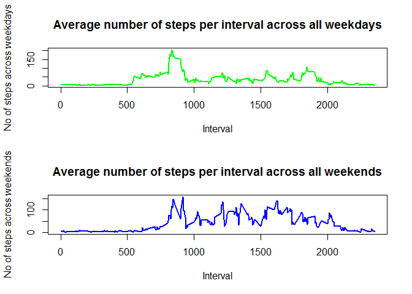

# Reproducible Research: Peer Assessment 1


## Loading and preprocessing the data

1.  Load the data


```r
library(knitr)
library(ggplot2)
setwd("F:/Module5/PeerAssessment1")
act.data <- read.csv("activity.csv",header = TRUE, sep = ",") 
```

2. Process the data


```r
dates <- strptime(act.data$date, "%Y-%m-%d") # Turn the date data into YYYY-MM-DD format
act.data$date <- dates
uniqueDates <- unique(dates) # Keep a list of all possible days
uniqueIntervals <- unique(act.data$interval) # Keep a list of all possible intervals
```

## What is mean total number of steps taken per day?

1. Calculate the total number of steps taken per day


```r
stepsSplit <- split(act.data$steps, dates$yday) #split up the data frame for steps by day
totalStepsPerDay <- sapply(stepsSplit, sum, na.rm=TRUE) #total number of steps each day
head(totalStepsPerDay) 
```

```
##   274   275   276   277   278   279 
##     0   126 11352 12116 13294 15420
```

2.  Create a histogram of the total number of steps taken each day


```r
par(mfcol=c(2,1))
plot(uniqueDates, totalStepsPerDay, main="Histogram of steps taken each day", xlab="Date (Oct-Nov 2012)", ylab="Frequency", type="h", lwd=4, col="green")
```

 

3.  Calculate and report the mean and median of the total number of steps taken per day


```r
## Mean steps per day
meanStepsPerDay <- sapply(stepsSplit, mean, na.rm=TRUE)
meanDataFrame <- data.frame(date=uniqueDates, meanStepsPerDay=meanStepsPerDay, row.names=NULL)
head(meanDataFrame)
```

```
##         date meanStepsPerDay
## 1 2012-10-01             NaN
## 2 2012-10-02         0.43750
## 3 2012-10-03        39.41667
## 4 2012-10-04        42.06944
## 5 2012-10-05        46.15972
## 6 2012-10-06        53.54167
```

```r
## Median steps per day
medianStepsPerDay <- sapply(stepsSplit, median, na.rm=TRUE)
medianDataFrame <- data.frame(date=uniqueDates, medianStepsPerDay=medianStepsPerDay, row.names=NULL)
head(medianDataFrame)
```

```
##         date medianStepsPerDay
## 1 2012-10-01                NA
## 2 2012-10-02                 0
## 3 2012-10-03                 0
## 4 2012-10-04                 0
## 5 2012-10-05                 0
## 6 2012-10-06                 0
```

## What is the average daily activity pattern?

1. Plot a time series (i.e. type = "l") of the 5-minute interval (x-axis) and the average number of steps taken, averaged across all days (y-axis)


```r
intervalSplit <- split(act.data$steps, act.data$interval) #split data to interval

# Find the average amount of steps per time interval - ignore NA values
averageStepsPerInterval <- sapply(intervalSplit, mean, na.rm=TRUE)

# Plot the time-series graph
par(mfcol=c(2,1))
plot(uniqueIntervals, averageStepsPerInterval, type="l",
     main="Average number of steps per interval across all days", 
     xlab="Interval", ylab="No of steps", 
     lwd=2, col="green")

# Find the location of where the maximum is
maxIntervalDays <- max(averageStepsPerInterval, na.rm=TRUE)
maxIndex <- as.numeric(which(averageStepsPerInterval == maxIntervalDays))
maxInterval <- uniqueIntervals[maxIndex] # Plot a vertical line where the max is
abline(v=maxInterval, col="red", lwd=3)
```

 

2.  Which 5-minute interval, on average across all the days in the dataset, contains the maximum number of steps?


```r
maxInterval
```

```
## [1] 835
```

## Imputing missing values

1.  Calculate and report the total number of missing values in the dataset


```r
isna<- is.na(act.data$steps)
sum(isna)
```

```
## [1] 2304
```

2.  Devise a strategy for filling in all of the missing values in the dataset


```r
meanStepsPerDay[is.nan(meanStepsPerDay)] <- 0 # Remove NaN values & replace with 0.  
meanColumn <- rep(meanStepsPerDay, 288) # Create a replicated vector of 288 intervals
rawSteps <- act.data$steps # the steps before replacement
stepsNA <- is.na(rawSteps) # Find NA in the raw steps data
rawSteps[stepsNA] <- meanColumn[stepsNA] #replace these values with their corresponding mean
```

3.  Create a new dataset that is equal to the original dataset but with the missing data filled in.


```r
act.dataNew <- act.data
act.dataNew$steps <- rawSteps
stepsSplitNew <- split(act.dataNew$steps, dates$yday) # split data frame for steps by day
totalStepsPerDayNew <- sapply(stepsSplitNew, sum) # find the total number of steps
```

4.  Make a histogram of the total number of steps taken each day and Calculate and report the mean and median total number of steps taken per day. 


```r
par(mfcol=c(2,1))
# Plot the histogram before imputing 
plot(uniqueDates, totalStepsPerDay, main="Histogram of steps taken each day before imputing", xlab="Date (Oct-Nov 2012)", ylab="Frequency", type="h", lwd=4, col="green")
# Plot the histogram after imputing
plot(uniqueDates, totalStepsPerDayNew, main="Histogram of steps taken each day after imputing", xlab="Date (Oct-Nov 2012)", ylab="Frequency", type="h", lwd=4, col="blue")
```

 

4(i).  Calculate the mean for the new dataset (NaN values replaced with 0)


```r
meanStepsPerDayNew <- sapply(stepsSplitNew, mean)
meanDataFrameNew <- data.frame(date=uniqueDates, meanStepsPerDay=meanStepsPerDay, 
meanStepsPerDayNew=meanStepsPerDayNew, row.names=NULL)
head(meanDataFrameNew)
```

```
##         date meanStepsPerDay meanStepsPerDayNew
## 1 2012-10-01         0.00000           32.33553
## 2 2012-10-02         0.43750            0.43750
## 3 2012-10-03        39.41667           39.41667
## 4 2012-10-04        42.06944           42.06944
## 5 2012-10-05        46.15972           46.15972
## 6 2012-10-06        53.54167           53.54167
```
4(ii).  Calculate the median steps per day


```r
medianStepsPerDayNew <- sapply(stepsSplitNew, median)
medianDataFrameNew <- data.frame(date=uniqueDates, medianStepsPerDay=medianStepsPerDay, 
medianStepsPerDayNew=medianStepsPerDayNew, row.names=NULL)
head(medianDataFrameNew)
```

```
##         date medianStepsPerDay medianStepsPerDayNew
## 1 2012-10-01                NA             36.09375
## 2 2012-10-02                 0              0.00000
## 3 2012-10-03                 0              0.00000
## 4 2012-10-04                 0              0.00000
## 5 2012-10-05                 0              0.00000
## 6 2012-10-06                 0              0.00000
```

## Are there differences in activity patterns between weekdays and weekends?

1.  Create a new factor variable in the dataset with two levels- "weekday" and "weekend" indicating whether a given date is a weekday or weekend day


```r
wdays <- dates$wday # 0 is for Sunday, 1 is for Monday, going up to 6 for Saturday

# Create numeric vector with 2 levels - 1 is for a weekday, 2 for a weekend
datawday <- rep(0, length(wdays)-1) # 17568 observations 
datawday[wdays >= 1 & wdays <= 5] <- 1 # Monday to Friday, set as 1
datawday[wdays == 6 | wdays == 0] <- 2 # Saturday or Sunday, set as 2

# Create a new factor variable that has labels Weekdays and Weekends
days <- factor(datawday, levels=c(1,2), labels=c("Weekdays", "Weekends"))
act.dataNew$DayType <- days # Create a new column that contains weekdays/weekends

# split up data into two data frames
dataWeekdays <- act.dataNew[act.dataNew$DayType == "Weekdays", ]
dataWeekends <- act.dataNew[act.dataNew$DayType == "Weekends", ]
```

2.  Create A time series plot (i.e. type = "l") of the 5-minute interval (x-axis) and the average number of steps taken, averaged across all weekday days or weekend days (y-axis). 


```r
# Further split up the Weekdays and Weekends into their own intervals
dataSplitWeekdays <- split(dataWeekdays$steps, dataWeekdays$interval)
dataSplitWeekends <- split(dataWeekends$steps, dataWeekends$interval)

# Find the average for each interval
meanStepsWeekdayInt <- sapply(dataSplitWeekdays, mean)
meanStepsWeekendInt <- sapply(dataSplitWeekends, mean)

par(mfcol=c(2,1))
plot(uniqueIntervals, meanStepsWeekdayInt, type="l",
main="Average number of steps per interval across all weekdays", 
xlab="Interval", ylab="No of steps across weekdays", 
lwd=2, col="green")

plot(uniqueIntervals, meanStepsWeekendInt, type="l",
main="Average number of steps per interval across all weekends", 
xlab="Interval", ylab="No of steps across weekends", 
lwd=2, col="blue")
```

 
